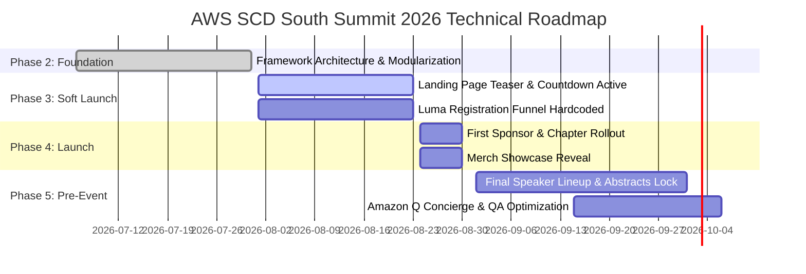

# AWS Student Community Day: South Summit 2026
## Technical Master Plan & Comprehensive Architecture Documentation

---

## 1. Executive Summary & Project Scope

### 1.1. Overview
**AWS Student Community Day: South Summit 2026 (AWS SCD: SS 2026)** is a premier full-day, student-led tech conference bringing together student builders, cloud enthusiasts, and technology advocates across the CALABARZON region (South Luzon, Philippines). 

The event website serves as the central operational hub for:
*   **Public Awareness & Branding**: Establishing a high-impact visual presence reflecting AWS cloud innovation.
*   **Registration Funneling**: Directing attendees to registration channels (e.g., Luma) with real-time countdown hype.
*   **Content Dissemination**: Displaying keynote speakers, technical sessions, community chapters, sponsor tiers, and exclusive event merchandise.
*   **Attendee Operations**: Interactive tools including custom modal popups, merch spotlight rail, and an embedded **Amazon Q** interactive assistant.

### 1.2. Strategic Objectives & Constraints
*   **Zero Build Dependency**: Built purely with native Web standards (HTML5, CSS3, ES Modules). No Node.js compilation, Webpack, Vite, or npm build step is required for production deployment.
*   **GitHub Pages Native**: Designed specifically to run from the root directory of a GitHub repository with relative pathing resilience.
*   **Decoupled Data Architecture**: Content is isolated into localized JavaScript data structures, enabling non-technical organizers to update speakers or sponsors without touching layout code.

---

## 2. Technical Architecture & Technology Stack

```
awssbg-scd2026-prototype/
├── index.html                   # Core semantic HTML5 layout & modal templates
├── styles.css                   # Component styles, responsive layouts & animations
├── theme.css                    # Design system tokens, color palettes & spatial grid
├── README.md                    # Primary GitHub repository landing page
├── CHANGELOG.md                 # Developer version history & prompt updates
├── docs/                        # Documentation Hub
│   ├── TECHNICAL_MASTERPLAN.md  # Technical Master Plan & Architecture reference
│   ├── FRAMEWORK_GUIDE.md       # Developer onboarding & content guide
│   └── EVENT_GUIDELINES.md      # Event operational guidelines & timeline
└── assets/
    ├── amazon-aws-logo.png      # AWS brand mark assets
    ├── Event-Primer.png         # Conceptual branding primer graphic
    ├── images/                  # Media asset directories
    │   ├── speakers/            # Speaker headshots
    │   ├── merch/               # Merchandise photos & previews
    │   ├── chapters/            # University chapter logos
    │   └── sponsors/            # Sponsor logos
    └── js/
        ├── main.js              # Central entry point (bootstraps all modules)
        ├── data/                # Pure Data Layer (Content Objects)
        │   ├── speakers.js      # Speaker details & talks
        │   ├── merch.js         # Merchandise catalog
        │   ├── chapters.js      # University student builder groups
        │   └── sponsors.js      # Sponsor tiers & partner links
        └── modules/             # Functional UI Presentation Layer
            ├── theme.js         # Light/Dark mode toggling & localStorage
            ├── routing.js       # SPA client-side router & mobile menu
            ├── countdown.js     # Real-time event countdown timer
            ├── speakersUI.js    # Marquee track, speaker grid & modal controller
            ├── merchUI.js       # Merch rail & spotlight interaction model
            ├── chaptersUI.js    # Chapter grid renderer
            ├── sponsorsUI.js    # Sponsor tier layout manager
            └── amazonQ.js       # Interactive Amazon Q floating concierge
```

### 2.1. Technology Stack Specifications
*   **Markup**: HTML5 (Semantic elements, ARIA attributes, SVG symbol defs).
*   **Styling**: Modern CSS3 (Custom properties, CSS Grid, Flexbox, backdrop filters, CSS keyframe animations).
*   **Logic Engine**: Vanilla JavaScript (ES6+ Modules via `<script type="module">`).
*   **Storage**: Browser `localStorage` for theme preference persistence.

### 2.2. Client-Side Routing Paradigm
The application implements a lightweight Single Page Application (SPA) architecture in `assets/js/modules/routing.js`:
*   Pages are wrapped in `.page` container elements (`#page-home`, `#page-about`, `#page-merch`).
*   The `showPage(pageName)` function toggles visibility by updating CSS classes and setting a global `data-page` attribute on `document.documentElement`.
*   Scroll state is managed dynamically: scrolling past 150px activates a solid glassmorphism background on the header (`.scrolled`) to guarantee legibility against background elements.

---

## 3. Design System & Visual Specification

### 3.1. Design Aesthetics & Branding
The visual identity relies on a **"Cyber-Grid"** aesthetic, mimicking terminal interfaces and AWS cloud console telemetry:
*   **Grid Background**: A repeating 52px geometric grid lines the viewport, punctuated by colorful visual anchor blocks.
*   **Glassmorphism**: Headers and cards utilize translucent background surfaces with `backdrop-filter: blur(12px)`.
*   **Typography**: Exclusively uses a monospaced font stack centered around **IBM Plex Mono** to reinforce developer focus.

### 3.2. Tokenized Color Palette (`theme.css`)

```css
:root {
  /* Brand Accent Tokens */
  --blue: #44b3fe;       /* Secondary accents, tech elements */
  --purple: #a759ff;     /* Tertiary highlights */
  --orange: #fc9907;     /* Primary Call-to-Action (CTA) & AWS energy */
  --green: #07e383;      /* Status indicators, confirmation badges */
  --pink: #fe57ea;       /* Vibrant visual anchor points */
  --ink-block: #161C24;  /* Deep contrast block fill */

  /* Spatial Grid Tokens */
  --grid-size: 52px;     /* Core layout unit */
  --grid-line: 1px;      /* Line weight */
  --container: 1280px;   /* Maximum page width */

  /* Typography Stack */
  --font-mono: 'IBM Plex Mono', ui-monospace, 'Cascadia Code', 'Source Code Pro', monospace;
}
```

### 3.3. Theme Engine Persistence (Light / Dark Mode)
To eliminate the Flash of Unstyled Content (FOUC):
1.  An inline blocking JavaScript snippet in `index.html` inspects `localStorage.getItem('scd-theme')` prior to DOM painting.
2.  If set to `dark`, it immediately applies `data-theme="dark"` to `<html>`.
3.  Theme transitions utilize smooth property easing: `transition: background-color .25s ease, color .25s ease`.

---

## 4. Pure Data Layer Specification & Governance

All event content is isolated in `assets/js/data/`. Modifying these JavaScript data files updates the rendered UI automatically without requiring HTML edits.

### 4.1. Speaker Schema (`speakers.js`)
```typescript
interface Speaker {
  id: string;             // Unique identifier (e.g., 'speaker-1')
  name: string;           // Full display name
  role: string;           // Title and affiliation (e.g., 'Solutions Architect · AWS')
  sessionTitle: string;   // Presentation title
  abstract: string;       // Detailed session summary
  status: 'CONFIRMED' | 'TBA' | 'KEYNOTE' | 'WORKSHOP'; // Dictates badge visual style
  picUrl: string;         // Relative image path
}
```

### 4.2. Sponsor Schema (`sponsors.js`)
```typescript
interface Sponsor {
  id: string;             // Unique identifier
  name: string;           // Partner name
  tier: 'platinum' | 'gold' | 'community'; // Determines logo sizing and grid layout
  imgUrl: string;         // Relative path to transparent logo
}
```

### 4.3. Merchandise Schema (`merch.js`)
```typescript
interface MerchItem {
  id: string;             // Unique identifier
  name: string;           // Item name
  blurb: string;          // Short description / details
  imgUrl: string;         // Relative photo path
}
```

### 4.4. Chapter Schema (`chapters.js`)
```typescript
interface Chapter {
  name: string;           // e.g., 'AWS SBG – Laguna'
  university: string;     // University name
  facebookUrl: string;    // Facebook page link
  linkedInUrl: string;    // LinkedIn page link
  email: string;          // Direct contact email
  imgUrl: string;         // Relative logo path
}
```

---

## 5. Event Roadmap & Technical Deliverables Alignment

Mapped directly to the operational phases outlined in the official `SCD South 2026.md` guidelines:



### Phase Deliverable Checklist

#### Phase 2: Branding & Foundation (July 6 – July 31)
- [x] Refactor monolithic structure into modular ES Modules.
- [x] Establish CSS custom property system (`theme.css`) and responsive layouts (`styles.css`).
- [x] Implement Light/Dark mode theme engine with `localStorage` persistence.

#### Phase 3: Soft Launch & Teaser Campaign (August 1 – August 23)
- [ ] Hardcode event date, theme, and tentative venue in hero header.
- [ ] Connect primary CTA buttons ("Register Now") directly to external Luma registration link (`https://lu.ma/...`).
- [ ] Calibrate countdown timer module (`countdown.js`) to target October 7, 2026.

#### Phase 4: Official Launch & Announcements (August 24 – August 30)
- [ ] Ingest confirmed university student builder groups into `chapters.js`.
- [ ] Ingest Batch 1 sponsor partners into `sponsors.js` categorized by tier.
- [ ] Update `merch.js` with official limited attendee merch catalog.

#### Phase 5: Pre-Event Finalization (September 1 – October 6)
- [ ] Finalize speaker roster and full talk abstracts in `speakers.js`.
- [ ] Program Amazon Q widget (`amazonQ.js`) with event FAQs (venue location, parking, agenda).
- [ ] Perform cross-browser testing and performance optimization for mobile connectivity.

---

## 6. Development & Operational Guide

### 6.1. Local Testing
Because native ES Modules require HTTP CORS handling, open `index.html` via a local HTTP server rather than double-clicking the file:
```bash
# Option 1: Python built-in HTTP server
python -m http.server 8000

# Option 2: Node.js serve package
npx serve .
```

### 6.2. Deployment Rules for GitHub Pages
1.  **Keep `index.html` in Root**: Do not move `index.html` into a subfolder.
2.  **Strict Relative Paths**: Always reference paths without leading slashes (e.g., `assets/js/main.js` instead of `/assets/js/main.js`).
3.  **No Build Step**: Pushing to the `main` branch immediately triggers live deployment via GitHub Pages.

### 6.3. Version Control & Changelog
For a complete version history of incremental updates and developer changes after each build iteration, refer to **[CHANGELOG.md](./CHANGELOG.md)**.

---
*Document Version: 2.2.0 (Master Edition)*  
*Target Event Date: October 7, 2026*  
*Maintainer: AWS Student Builder Groups — CALABARZON Tech Team*
